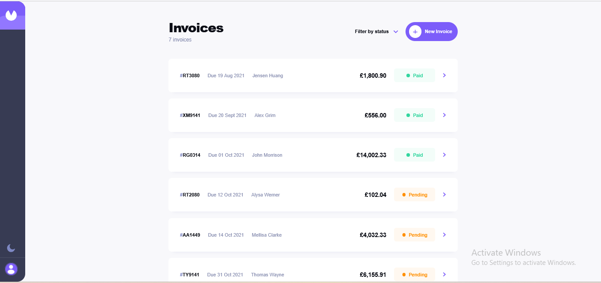

# Invoice App

Built by Shehu Abdulkadir

A responsive invoice management app built with React, Vite, and React Router. It supports invoice listing, detail views, creation, editing, deletion, filtering by status, theme switching, and local persistence through `localStorage`.

## Features

- Create, edit, delete, and mark invoices as paid
- Filter invoices by status
- View invoice details with responsive layouts
- Persist invoice data and theme preference in `localStorage`
- Support light and dark theme switching

## Screenshot

Add a project screenshot at `public/app-screenshot.png`, then this preview will render automatically.



## Setup Instructions

### Requirements

- Node.js 18+ recommended
- npm

### Install dependencies

```bash
npm install
```

### Start the development server

```bash
npm run dev
```

### Build for production

```bash
npm run build
```

### Preview the production build

```bash
npm run preview
```

### Lint the project

```bash
npm run lint
```

## Architecture Explanation

The app uses a small feature-oriented React structure with shared state managed through Context.

### Core flow

- `src/main.jsx` bootstraps the app and wraps it with `BrowserRouter`, `ThemeProvider`, and `InvoiceProvider`.
- `src/App.jsx` defines the main layout and routing.
- `src/pages/InvoiceListPage.jsx` renders the invoice list, filtering UI, and create-invoice modal.
- `src/pages/DetailPage.jsx` renders the invoice detail screen plus edit/delete/mark-as-paid actions.

### State management

- `src/context/InvoiceContext.jsx` manages invoice data with `useReducer`.
- Invoice data is initialized from `localStorage` and falls back to seeded data from `src/data/sampleData.js`.
- `src/context/ThemeContext.jsx` manages light/dark theme state and persists the selected theme in `localStorage`.

### UI components

- Presentational and reusable UI lives in `src/components`.
- Examples:
  - `InvoiceCard` for list items
  - `InvoiceForm` for create/edit
  - `StatusBadge` for status display
  - `FilterDropdown` for invoice filtering
  - `ConfirmModal` for destructive confirmation

### Utilities

- `src/utility/helpers.js` contains formatting and calculation helpers.
- `src/utility/validation.js` contains invoice form validation logic.

### Styling

- The app uses a single global stylesheet in `src/index.css`.
- Theme values are defined via CSS variables in `src/styles/variables.css`.
- Responsive behavior is organized by breakpoints for mobile, tablet, and larger screens.

## Trade-Offs

### Why Context + Reducer

Using Context with `useReducer` keeps the app simple and avoids bringing in a larger state library for a relatively small project. The trade-off is that scaling to much more complex async workflows would likely benefit from a more specialized state solution.

### Why localStorage persistence

`localStorage` makes the app easy to run without a backend and keeps the setup lightweight. The trade-off is that data is browser-local, not shared across devices, and not suitable for multi-user collaboration.

### Why global CSS

A single stylesheet makes it straightforward to move quickly and maintain visual consistency across the app. The trade-off is that styles are less isolated than CSS Modules or a component-scoped styling approach.

### Why client-side routing only

React Router keeps navigation simple for the list/detail flow. The trade-off is that all data is still managed client-side, so the routing layer is thin and not yet connected to server-backed resources.

## Accessibility Notes

The app includes several accessibility-focused behaviors:

- Semantic buttons are used for interactive actions.
- Keyboard interaction is supported on invoice cards and custom dropdown options.
- Dialogs use `role="dialog"` and `aria-modal="true"`.
- Escape key handlers are included for modal dismissal.
- The invoice form includes focus management and a simple focus trap while open.
- Status badges expose readable `aria-label` values.
- Buttons with icon-only intent include accessible labels where needed.

Areas that could still be improved:

- Add more explicit screen-reader messaging for validation summaries.
- Improve list and dialog announcements with `aria-labelledby` and `aria-describedby`.
- Add stronger visible focus styling consistency across all interactive elements.

## Improvements Beyond Requirements

The current implementation includes a few extra touches beyond a basic CRUD invoice UI:

- Persistent invoice data using `localStorage`
- Persistent theme selection
- Responsive list/detail layouts across phone, tablet, and desktop sizes
- Empty-state UI when no invoices match the current filter
- Confirm-delete flow to reduce accidental destructive actions
- Utility-based formatting for dates, currency, totals, and invoice IDs
- Seed data for easier local testing

## Project Structure

```text
src/
  components/
  context/
  data/
  pages/
  styles/
  utility/
  App.jsx
  index.css
  main.jsx
```

## Notes

- Invoice data is stored in the browser, so clearing browser storage resets the saved invoices.
- Seed data is used only when no stored invoice data exists.
